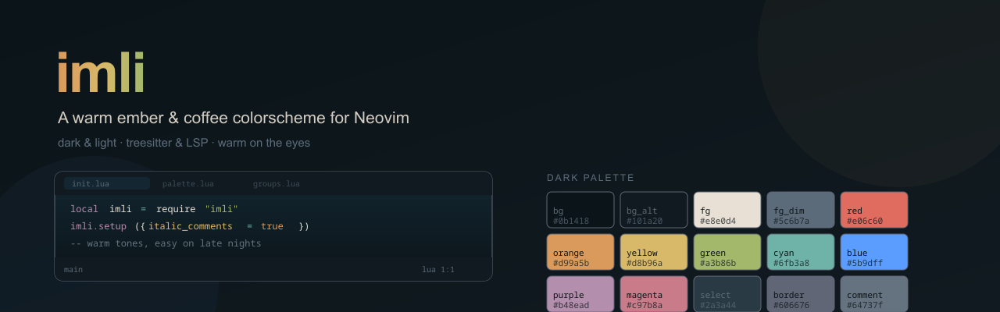

<p align="center">
  
</p>

<h1 align="center">imli.nvim</h1>

<p align="center">
  A warm ember &amp; coffee colorscheme for Neovim.<br/>
  Dark &amp; light variants &middot; Treesitter &amp; LSP &middot; warm on the eyes during late nights.
</p>

<p align="center">
  
  
  
</p>

---

## Features

- **Two hand-tuned variants** — a warm dark (`#0b1418` base) and a cream-paper light
- **Treesitter-first** — full coverage for the common captures, plus LSP semantic token overrides
- **UI consistency** — statusline, tabline (with clear active/inactive separation), popups, diagnostics, which-key, mini.icons
- **Configurable comments** — adjust comment opacity and italics to taste
- **Per-filetype overrides** — winhighlight-based, no glitch
- **Terminal colors** — sets all 16 terminal slots to match the palette

## Requirements

- Neovim **0.9+** (uses `nvim_set_hl`)
- `termguicolors` enabled (set automatically by the colorscheme)
- The native `vim.pack` install method below additionally requires Neovim **0.12+**

## Installation

### [lazy.nvim](https://github.com/folke/lazy.nvim)

```lua
{
  "your-github-username/imli-nvim",
  lazy = false,
  priority = 1000,
  config = function()
    require("imli").setup({
      -- your options here
    })
    vim.cmd("colorscheme imli")
  end,
}
```

### Native `vim.pack` (Neovim 0.12+)

No plugin manager needed — Neovim's built-in package manager:

```lua
-- init.lua
vim.pack.add({
  "https://github.com/your-github-username/imli-nvim",
  -- or the table form:
  -- { src = "https://github.com/your-github-username/imli-nvim", name = "imli" },
})

require("imli").setup()
vim.cmd("colorscheme imli")
```

That's it — the plugin is cloned on first use and tracked in the lockfile
(`vim.pack-lockfile`). Useful commands:

| Action | Command |
|--------|---------|
| Update all plugins | `vim.pack.update()` |
| Update one plugin | `vim.pack.update({ "imli" })` |
| Remove a plugin | `vim.pack.del({ "imli" })` |
| List installed | `vim.pack.get()` |

**Lazy loading** with `vim.pack` — add with `load = false`, then `packadd` on demand:

```lua
vim.pack.add({ src = "https://github.com/your-github-username/imli-nvim", load = false })

-- later, when you want it:
vim.cmd.packadd("imli")
require("imli").setup()
vim.cmd("colorscheme imli")
```

### [packer.nvim](https://github.com/wbthomason/packer.nvim)

```lua
use {
  "your-github-username/imli-nvim",
  config = function()
    require("imli").setup()
    vim.cmd("colorscheme imli")
  end,
}
```

### [vim-plug](https://github.com/junegunn/vim-plug)

```vim
Plug 'your-github-username/imli-nvim'
```

```lua
-- in init.lua:
require("imli").setup()
vim.cmd("colorscheme imli")
```

## Configuration

All options are optional — `require("imli").setup()` with no arguments uses the defaults below.

```lua
require("imli").setup({
  -- Italicize comments
  italic_comments = true,

  -- Comment visibility: 0.1 (barely visible) .. 1.0 (full color)
  comment_opacity = 1.0,

  -- Per-filetype highlight overrides (winhighlight-based).
  -- nil = use the built-in defaults from imli.filetypes.
  -- Pass your own table to override or extend:
  filetypes = nil,
  -- filetypes = {
  --   python = {
  --     ["@keyword"] = { fg = "#b48ead", bold = true },
  --     ["@function.call"] = { fg = "#9564DD" },
  --   },
  --   lua = {
  --     ["@keyword"] = { fg = "#b48ead", bold = true },
  --   },
  -- },
})
```

Then load it:

```lua
vim.cmd("colorscheme imli")
```

### Full example (lazy.nvim)

```lua
{
  "your-github-username/imli-nvim",
  lazy = false,
  priority = 1000,
  config = function()
    require("imli").setup({
      italic_comments = true,
      comment_opacity  = 0.8,   -- slightly dimmer comments
      filetypes        = nil,  -- built-in python/lua overrides
    })
    vim.cmd("colorscheme imli")
  end,
}
```

## Palette

### Dark

| Role       | Hex       | Swatch |
|------------|-----------|--------|
| `bg`       | `#0b1418` |  |
| `bg_alt`   | `#101a20` |  |
| `fg`       | `#e8e0d4` |  |
| `fg_dim`   | `#5c6b7a` |  |
| `comment`  | `#64737f` |  |
| `red`      | `#e06c60` |  |
| `orange`   | `#d99a5b` |  |
| `yellow`   | `#d8b96a` |  |
| `green`    | `#a3b86b` |  |
| `cyan`     | `#6fb3a8` |  |
| `blue`     | `#5b9dff` |  |
| `purple`   | `#b48ead` |  |
| `magenta`  | `#c97b8a` |  |
| `selection`| `#2a3a44` |  |
| `border`   | `#606676` |  |

### Light

| Role       | Hex       | Swatch |
|------------|-----------|--------|
| `bg`       | `#e7dfd2` |  |
| `bg_alt`   | `#f2ede4` |  |
| `fg`       | `#4a4238` |  |
| `fg_dim`   | `#8b97a5` |  |
| `comment`  | `#77838f` |  |
| `red`      | `#b4463c` |  |
| `orange`   | `#a8641f` |  |
| `yellow`   | `#8a6d1f` |  |
| `green`    | `#5e7a2f` |  |
| `cyan`     | `#2f7a70` |  |
| `blue`     | `#2f6fd0` |  |
| `purple`   | `#7e5a8e` |  |
| `magenta`  | `#a35262` |  |
| `selection`| `#dcd2bf` |  |
| `border`   | `#c2b6a2` |  |

## Supported Plugins / UI

- Built-in Neovim UI (statusline, tabline, popups, diagnostics, floats)
- Treesitter &amp; LSP semantic tokens
- [which-key](https://github.com/folke/which-key.nvim)
- [mini.icons](https://github.com/echasnovski/mini.icons)
- [render-markdown](https://github.com/MeanderingProgrammer/render-markdown.nvim)

## License

MIT
